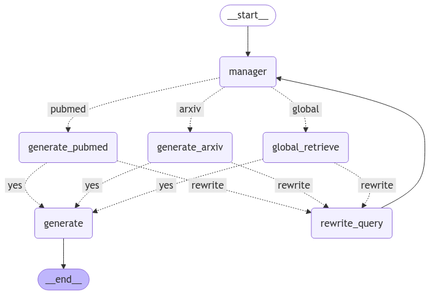

# **LangGraph Research Assistant 🚀**

## **Overview**
This project implements a **multi-agent research assistant** using **LangGraph**, designed to retrieve, refine, and generate research-based responses. The pipeline intelligently selects sources (**PubMed, Arxiv, Global**), rewrites queries if needed, and generates a structured response.

---

## **Workflow**

### **1️⃣ Query Classification**
- The `manager` node determines the most suitable retriever based on the query type:  
  - **PubMed** → For medical and healthcare-related queries  
  - **Arxiv** → For AI, technology, and computer science-related queries  
  - **Global Retrieve** → For general topics  

### **2️⃣ Retrieval & Validation**
- The assigned retriever fetches documents.  
- If the retrieved documents are **relevant**, they are passed to the `generate` node.  
- If not, the query is rewritten using the `rewrite_query` node and retrieval is attempted again.  

### **3️⃣ Response Generation**
- Once relevant documents are found, they are passed as context to the `generate` node.  
- The final response is generated and returned.  

---

## **Pipeline Diagram**



The pipeline consists of the following components:

- **`manager`** → Classifies the query into **PubMed, Arxiv, or Global Retrieve**  
- **`generate_pubmed` / `generate_arxiv` / `global_retrieve`** → Retrieves relevant documents  
- **`rewrite_query`** → Rewrites queries if no relevant documents are found  
- **`generate`** → Produces the final response  

---

## **Installation & Setup**

### **Prerequisites**
- Python `>=3.10`  
- Install dependencies:

```bash
pip install poetry
poetry install
```

```bash
export TOGETHER_API_KEY="your-key-here"
```

